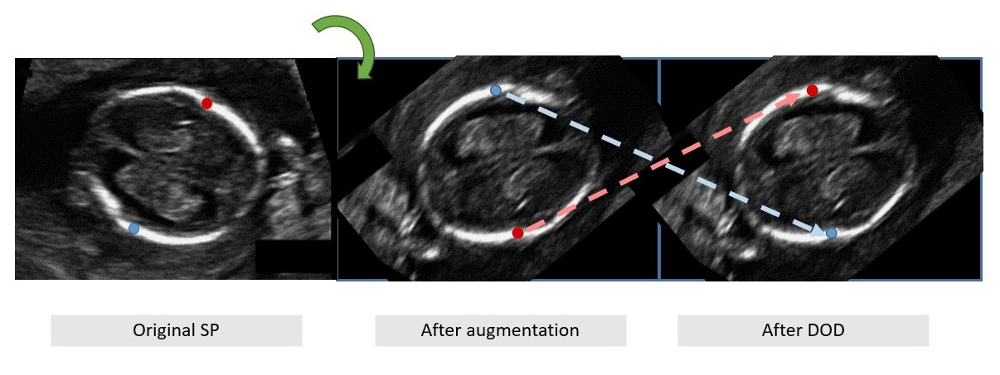
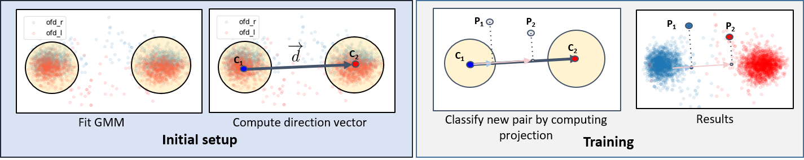

# fetalbiometry
Automatic Fetal Biometry 

# Dynamic Oritentation Determination

As fetal structure may appear in any orientation, any solution should handle the orientation variability. A common way to handle such variability is augmentation. However, rotation augmentation may cause landmark class labeling (e.g left/right landmarks) to be inconsistent with image coordinates, i.e. the left and right points may be switched, which will hamper the network training.
 DOD Motivation and example. (a) roriginal standard plane (SP) image of fetal trans-vetricular plane with bi-parietal diameter (BPD) biometry ground-truth up (red) and down (green) landmarks; (b) image after rotation with inconsistent landmark labeling (up/down switched); (c) reassignment of labels classes using dynamic orientation determination (DOD).

This inconsistency can be corrected by performing landmark class reassignment (LCR) \cite{avisdris2021fmlnet}, which preserves horizontal (left/right) landmark class consistency after all augmentations and has been shown to improve biometry estimation accuracy.
% Landmark class reassignment~\cite{avisdris2021fmlnet} determines the specific class of horizontal (left-right) measurement landmark pairs within network training. This mechanism has been shown to improve biometry measurement using landmark regression network~\cite{avisdris2021fmlnet}, as it preserves landmark class consistency after all augmentations. 
%
However, different biometric measurements may have different spatial orientation, for example, OFD is mostly vertical and BPD is mostly horizontal. 
To overcome this issue, we introduce the DOD mechanism, which determines measurement-wise orientation and then applies class reassignment, instead of only computing the horizontal measurement landmark pairs as in (1). 
 
The proposed DOD is composed of two stages (Fig. XXX). 
%
In the \textit{initial setup} stage, the database-wise orientation is determined by fitting a Gaussian Mixture Model of 2 Gaussians with Expectation-Maximization algorithm\cite{dempster1977EM} onto the ground-truth landmarks of training dataset of each biometry. This is followed by computing the directional vector between two centroids of the Gaussians: $\overrightarrow{d} = \overrightarrow{C_1C_2}$. 
%
In the network \textit{training} stage, each biometry landmark pair ($P = p_1, p_2$), after all augmentations, are projected on the directional vector $r_i = (p_i \cdot \overrightarrow{d})/{|\overrightarrow{d}|}$ and then sorted by their projection $sort(|r_i|)$ to obtain their reassigned class. 


## Initial setup
```python
def determine_direction(pts_arr, do_plot=False):
    gmm = GaussianMixture(n_components=2)
    gmm.fit(pts_arr)
    if do_plot:
        plt.scatter(pts_arr[::2,0], pts_arr[::2,1], alpha=.1)
        plt.scatter(pts_arr[1::2,0], pts_arr[1::2,1], color='r',alpha=.1)
        plt.plot(gmm.means_[:,0], gmm.means_[:,1], color='k')
    return gmm.means_
```

## Training phase

```python
def classify_direction(pts_arr, d_pts):
    d_vector = d_pts[1, :] - d_pts[0, :]
    ap = pts_arr  
    pt_part1 = np.dot(d_vector[np.newaxis, :], ap.T) / np.linalg.norm(d_vector)
    pts_class = pt_part1.flatten()
    pts_class = pts_class.reshape(-1, 2)
    pts_class = np.stack((np.argmin(pts_class, axis=1), np.argmax(pts_class, axis=1)), axis=1) 

    pts_remap = pts_class + (np.arange(pts_class.shape[0]) * 2)[:, np.newaxis]
    ret_pts = pts_arr[pts_remap]
    return ret_pts
```


## How to use?

```python
...
# Augmentation here
tpts = (classify_direction(tpts/self.output_size, self.d_vector)*self.output_size)[0]
# Where self.output_size is the output map size and self.d_vector is the learned direction vector

```
